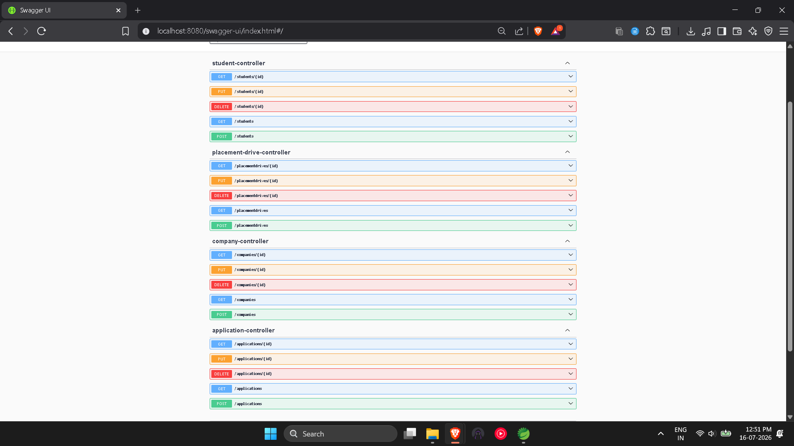

\# CareerConnect - Placement Management System


A Spring Boot REST API application for managing campus placement activities. The system enables administrators to manage students, companies, placement drives, and job applications through RESTful APIs with Swagger documentation.


\---


\## Features


\- Student Management (CRUD)

\- Company Management (CRUD)

\- Placement Drive Management (CRUD)

\- Job Application Management (CRUD)

\- RESTful API Development

\- Spring Data JPA \& Hibernate

\- Global Exception Handling

\- Input Validation using Jakarta Validation

\- Swagger/OpenAPI Documentation

\- Unit Testing with JUnit 5 \& Mockito


\---


\## Tech Stack


| Technology | Version |

|------------|---------|

| Java | 24 |

| Spring Boot | 4.x |

| Spring Data JPA | Latest |

| Hibernate | Latest |

| MySQL | 8.x |

| Maven | Latest |

| Swagger/OpenAPI | Latest |

| JUnit 5 | Latest |

| Mockito | Latest |

| Lombok | Latest |


\---


\## Project Structure


```text

CareerConnect

│

├── src

│   ├── main

│   │   ├── java

│   │   │   └── com.careerconnect

│   │   │       ├── controller

│   │   │       ├── model

│   │   │       ├── repository

│   │   │       ├── service

│   │   │       │   └── impl

│   │   │       ├── exception

│   │   │       └── CareerConnectApplication.java

│   │   └── resources

│   │       └── application.properties

│   │

│   └── test

│       └── java

│           └── com.careerconnect

│               └── service

│

├── screenshots

├── README.md

├── pom.xml

└── .gitignore

```


\---


\# Modules


\## Student Module


\- Add Student

\- View Student

\- View All Students

\- Update Student

\- Delete Student


\---


\## Company Module


\- Register Company

\- View Company

\- View All Companies

\- Update Company

\- Delete Company


\---


\## Placement Drive Module


\- Create Placement Drive

\- View Placement Drive

\- View All Placement Drives

\- Update Placement Drive

\- Delete Placement Drive


\---


\## Application Module


\- Apply for Job

\- View Application

\- View All Applications

\- Update Application Status

\- Delete Application


\---


\# REST API Endpoints


\## Student APIs


| Method | Endpoint |

|---------|----------|

| POST | `/students` |

| GET | `/students` |

| GET | `/students/{id}` |

| PUT | `/students/{id}` |

| DELETE | `/students/{id}` |


\---


\## Company APIs


| Method | Endpoint |

|---------|----------|

| POST | `/companies` |

| GET | `/companies` |

| GET | `/companies/{id}` |

| PUT | `/companies/{id}` |

| DELETE | `/companies/{id}` |


\---


\## Placement Drive APIs


| Method | Endpoint |

|---------|----------|

| POST | `/placement-drives` |

| GET | `/placement-drives` |

| GET | `/placement-drives/{id}` |

| PUT | `/placement-drives/{id}` |

| DELETE | `/placement-drives/{id}` |


\---


\## Application APIs


| Method | Endpoint |

|---------|----------|

| POST | `/applications` |

| GET | `/applications` |

| GET | `/applications/{id}` |

| PUT | `/applications/{id}` |

| DELETE | `/applications/{id}` |


\---


\# API Documentation


After running the application, Swagger UI can be accessed at:


```text

http://localhost:8080/swagger-ui/index.html

```


\---


\# Running the Project


\## Clone the Repository


```bash

git clone https://github.com/Harshyyuu/CareerConnect.git

```


\## Navigate to the Project


```bash

cd CareerConnect

```


\## Configure Database


Update the MySQL configuration in:


```text

src/main/resources/application.properties

```


Example:


```properties

spring.datasource.url=jdbc:mysql://localhost:3306/careerconnect

spring.datasource.username=root

spring.datasource.password=your\_password

```


\## Run the Application


```bash

mvn spring-boot:run

```


The application starts on:


```text

http://localhost:8080

```


\---


\# Testing


Unit testing has been implemented using:


\- JUnit 5

\- Mockito


Service layer testing has been completed successfully.


\---


\# Exception Handling


The project includes centralized exception handling using:


\- GlobalExceptionHandler

\- ResourceNotFoundException


This ensures meaningful error responses for invalid requests and missing resources.


\---


\# Screenshots


\## Swagger UI


!\[Swagger UI](screenshots/01\_Swagger\_UI.png)


\---


\## Create Student


!\[Create Student](screenshots/02\_Create\_Student.png)


\---


\## Get All Students


!\[Get All Students](screenshots/03\_Get\_All\_Students.png)


\---


\## Update Student


!\[Update Student](screenshots/04\_Update\_Student.png)


\---


\## Delete Student


!\[Delete Student](screenshots/05\_Delete\_Student.png)


\---


\## Create Company


!\[Create Company](screenshots/06\_Create\_Company.png)


\---


\## Create Placement Drive


!\[Create Placement Drive](screenshots/07\_Create\_Placement\_Drive.png)


\---


\## Create Application


!\[Create Application](screenshots/08\_Create\_Application.png)


\---


\## Exception Handling


!\[Exception Handling](screenshots/09\_Exception\_Handler.png)


\---


\# Future Enhancements


\- JWT Authentication

\- Spring Security

\- Role-Based Access Control

\- Resume Upload

\- Email Notifications

\- Placement Eligibility Checker

\- Docker Support

\- CI/CD Integration

\- Cloud Deployment (AWS)


\---


\# Author


\*\*Harsh Pratap Singh\*\*


B.Tech Computer Science \& Engineering


The NorthCap University


GitHub: \*\*https://github.com/Harshyyuu\*\*


\---


\## License


This project is developed for educational purposes as part of a Spring Boot backend development project.
## Test Image



